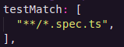
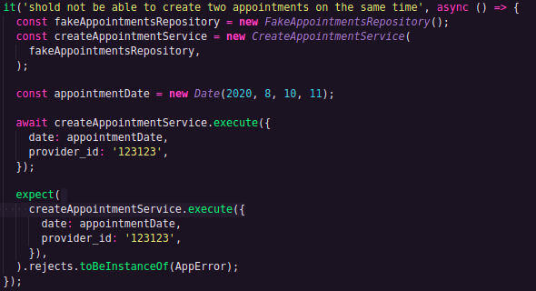
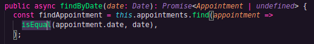

# back-end-GoBarber-v2

- Foi redirecionado alguns arquivos para a nova arquitetura de sistema tornando-se um projeto mais escalável

- Dentro de src foi refatorado/movido as pastas database, models, services, repositories, middlewares, routes, e em breve será movido o arquivo server.ts

- Foram criados novos diretorios para a refatoração modules e shared. A pasta modules possui dois subdiretorios users e appointments, dentro deles estão entities repositories e services.

E os arquivos da pasta models foram movidos para pasta entities

- Dentro da pasta shared estão as pastas database, errors, middlewares e routes.

## Camadas de domínio e camada de infra

### Infra: decisões tecnicas.
  src/shared/infra
  ferramentas, frameworks, stack, banco, biblioteca e etc.
  Coloca apenas coisas que um dia podem ser migradas, e não dependentes como a pasta errors.

  tudo o que for relacionado com express, ou com a camada http da aplicação ficará no diretório shared/infra/http
  middlewares, rotas e o arquivo server.ts

  mkdir src/modules/users/infra/typeorm
  mkdir src/modules/appointments/infra/typeorm

  como as entidades(entities) são puro typeorm, obviamente serão movidas para /appointments/infra/typeorm e será feito o mesmo no modulo users

  rename shared/infra/database shared/infra/typeorm

### Domínio: decisões de regras de negócio.
  o que o nosso Cliente/Usuário precisa.

### services isolam regra de negócio

em ts.config descomentar baseUrl e paths e colocar

Para diminuir a importação com os atalhos, haverá menos '../../../'

mkdir modules/appointments/infra/http/routes

cd shared/infra/http/routes
mv appoitments.routes.ts /modules/appointments/infra/http/routes/

e o mesmo acontece com a rota e modulo de usuarios, a rota sessions está ligada com usuários

reorganizar as importações aos seus devidos em shared/infra/http/routes/index.ts

cd shared/infra/http
mv middlewares /modules/users/infra/http/

reorganizar as importações nas rotas de appointments e usuarios

reorganizar as importações nas entidades de appointments e usuários

reorganizar a importação de entidade nos repositórios appointments e usuários

reorganizar as importações em services.

reorganizar a importação de rota em shared/infra/http/routes/server.ts

trocar o endereço do arquivo de inicialização la no package.json no fim do comando dev:server e start, de src/server.ts para src/shared/infra/http/server.ts.

o node não intende as importações com a @ como o VSCode é necessario instalar a lib tsconfig-paths -D

e no inicio do comando dev:server colocar uma flag -r tsconfig-paths/register

# Liskov Substitution Principle
Nesse momento isolei um pouco mais a camada de appointments da aplicação, ela ainda tinha uma importação do typeorm. E para facilitar na manutenibilidade do código temos que isolar com uma interface.  Sendo assim criamos uma interface em src/modules/appointments/repositories/IAppointments.

Além disso foi implementado uma nova regra eslint para criação de interfaces.

essa regra nos obriga a colocar um I em todas as interfaces do projeto.

<a href="https://github.com/typescript-eslint/typescript-eslint/issues/1915">[interface-name-prefix]</a>

dentro de infra coloquei a pasta repositories dentro de typeorm

e criei a interface no modulo de agendamentos

mkdir src/modules/appointments/repositories
touch src/modules/appointments/repositories/IAppointmentsRepository.ts

 a estrutura de pastas ficou assim:
  

dentro dessa interface:
 

e repository que está dentro de typeorm eu importo essa interface e a implemento, também alterei o retorno que antes era Appointment ou null, agora está Appointment ou undefined.

o que foi intendido aqui é que isolamos a nossa entidade para facilitar uma troca de banco se necessario, no futuro.

## Rewriting repository

Começamos a desacoplar as regras de negócios da parte de infra. em services o arquivo presente ainda utiliza metodos do typeorm.

refatoramos bastante o nosso repositório, prefiro mostrar a ilustração do que mudou pra facilitar o entendimento:
 

mkdir src/modules/appointments/dtos
touch src/modules/appointments/dtos/ICreateAppointmentDTO.ts

isolei a interface que tipava o parametro do método execute() na classe CreateAppointmentService e removi a interface que estava acima, em services.

# Dependency inversion principle

Inversão de dependência. A Letra "I" do SOLID

Single Responsability Principle  
Open Closed Principle  
Liskov Substitution Principle  
Interface Segregation Principle  
Dependency Invertion Principle  

Ao invés do service lidar diretamente com o repositório importado no arquivo do service, iremos receber esse mesmo repositório como parâmetro do constructor desse service passando o tipo dele como sendo a interface criada anteriormente para implementar no próprio repositório.

foi necessario desabilitar uma regra eslint para usar o constructor.
"no-useless-constructor":"off",

foram refatorados a rota de appointments e o service de criação de appointment que um ponto que usa muito da camada de infra, porém foi decidido não isolar completamente o service, até o momento.

ilustração das mudanças:
 -

# Refatorando módulo de usuários

<a href="https://github.com/Luciano-Ferreira/Iniciando-back-end/commit/a4f01c4d44b3c2bb730615be016aa598edf980bd" target="_blank" >Mais detalhes do commit</a>

Removi tudo que é diretamente relacionado com typeorm dos services como fiz anteriormente no modulo de appointments.

mkdir src/users/repositories/
touch src/modules/users/repositories/IUsersRepository.ts

Criei essa interface que irá "substituir" as querys do typeorm

na rota de usuário e de sessões:
 
 é necessário importar a classe UsersRepository que fica em @modules/users/infra/typeorm/repositories/UsersRepository

 e criar uma variavel que a instancie essa classe, e passar essa variavel como parâmetro em CreateUserService() e UpdateUserAvatarService.

 A aplicação ainda não vai rodar. Como trocamos toda a estrutura de pastas e arquivos incluindo as rotas, é necessario trocar os diretórios das entities, migrations, e migrationDir nas configurações do typeorm

 

## Injeção de dependência

yarn add tsyringe
mkdir src/shared/container

container injeta as dependências

## Controllers

nos controlers vamos abstrai a lógica que estava dentro da rota.

arquitetura restfull o  controller pode ter apenas 5 métodos:
 
index,
show,
create,update,delete

# Testes Automatizados

Garantem que a nossa aplicação continue funcionando independente do número de novas funcionalidades e do número de devs no time.

1. Testes unitários (TDD)

Testam funcionalidades específicas da nossa aplicação (precisam ser funções puras).

JAMAIS: Chamada à uma API, e efeito colateral

2. Testes de integração

Testam uma funcionalidade completa, passando por várias camadas da aplicação.

Route → Controller → Serviço → Repositório ...

3. Teste E2E

Teste que simulam a ação do usuário dentro da nossa aplicação.

- 1. Clique no input de email
- 2. Preencha luciano2023silva@gmail.com
- 3. Clique no input de senha
- 4. Preencha 123456
- 5. Clique no botão "Logar"
- 6. Espero que a página tenha enviado o usuário para o dashboard

# TDD (Test Driven Development)

- O usuário quando ele se cadastrar na aplicação, ele deve receber um email de boas-vindas;

## Configurando Jest

yarn add jest -D
yarn add ts-jest -D
yarn add @types/jest -D

yarn jest --init

✔ Would you like to use Jest when running "test" script in "package.json"? … yes
✔ Choose the test environment that will be used for testing › node
✔ Do you want Jest to add coverage reports? … no
✔ Which provider should be used to instrument code for coverage? › babel
✔ Automatically clear mock calls and instances between every test? … yes

tudo que fica em env no eslintrc.json são as funções globais, e é necessario adicionar o jest para utilizar.

<a href="https://www.notion.so/Configurando-Jest-a6d8bda77a164e8eb1ca831c893a3d57">Configurando Jest </a>

## Pensando nos testes/Criando primeiro teste

Não irei interagir com o nosso repositório original por que é muito passivo a erros, vou criar um repositório "fake".

mkdir src/modules/appointments/repositories/fakes
touch src/modules/appointments/repositories/fakes/FakeAppointmentsRepository.ts

Este arquivo o código semelhante ao AppointmentRepository

touch src/modules/appointments/services/CreateAppointmentService.spec.ts

o jest não entende os nosso atalhos de diretório, '@modules/appointments...'. No arquivo jest.condig.js na linha 151 descomentei o testMatch e passei ele como: 

foi necessario setar a baseURL na linha 86 que pra isso foi necessário as variaveis pathsToModuleNameMapper de 'ts-jest/utils' e compilerOptions de 'tsconfig.json'.

o javascript não entende comentário dentro do json então é necessario remover todos os comentários do tsconfig.json

e enfim criamos um teste unitário.

## Coverage report

Basicamente ele entrega um relatório dos testes feitos e não feitos no projeto, a melhor resposta de onde estamos e onde precisamos chegar no nosso projeto é abrindo o arquivo coverage/lcov-report/index.html

Em jest.config.js na linha 21 vamos setar o collectCoverage para true, e

na linha 24 collectCoverageFrom: adiciona ['<rootDir>/src/modules/**/services/*.ts']

na linha 30 coverageDirectory: 'coverage'

na linha 41 coverageReporters: ["text-summary", "lcov"]

No teste em que criei ainda resta uma possibilidade de teste, uma "branch" a o if que dispara um erro se o agendamento tiver com a mesma daa ou horario igual, ele dispara um erro.

para criar o teste:  

mas mesmo assim o teste não está funcionando como deveria.

é necessario que na nossa fakeAppointmentRepository alterar a comparação de timestamp com a função isEqual do 'date-fns'

## Testando criação de usuário

## Testando Autenticação de usuario

Um teste não pode depender de outro teste, como o teste de autenticação é necessario um usuario criado na fakeUserRepository.ts. vou criar um novo usuario usando o CreateUSerService

mkdir src/modules/users/providers
mkdir src/modules/users/providers/HashProvider
mkdir src/modules/users/providers/HashProvider/models
mkdir src/modules/users/providers/HashProvider/implementations
mkdir src/modules/users/providers/HashProvider/fakes

dentro de models ficara interfaces

touch src/modules/users/providers/HashProvider/models/IHashProvider.ts
touch src/modules/users/providers/HashProvider/implementations/BCryptHashProvider.ts

touch src/modules/users/providers/index.ts

esse arquivo vai fazer as mesma coisas que o index.ts do container, porem apenas com arquivos especificos do modulo de usuário.

e esse mesmo arquivo sera importado no shared/container

touch src/modules/users/providers/HashProvider/fakes/FakeHashProvider.ts

## provider storage

Content Delivery Network

Amazon S3 | Google Cloud Storage | DO Spaces

vou isolar a responsabilidade de armazenar as imagens/avatar

mkdir src/shared/container/providers
mkdir src/shared/container/providers/StorageProvider
mkdir src/shared/container/providers/StorageProvider/models
mkdir src/shared/container/providers/StorageProvider/implementations
mkdir src/shared/container/providers/StorageProvider/fakes
touch src/shared/container/providers/StorageProvider/models/IStorageProvider.ts
touch src/shared/container/providers/StorageProvider/implementations/DiskStorageProvider.ts

mkdir tmp/uploads
touch src/shared/container/providers/index.ts

touch src/shared/container/providers/StorageProvider/fakes/FakeStorageProvider.ts

## Atualização de avatar

touch src/modules/users/services/UpdateUserAvatarService.spec.ts

será utilizado o metodo spyOn() do jest

que pode ser utilizada para monitorar qualquer função

# Mapeando features do sistema

## Recuperação de senha

**RF**
- O usuário deve poder recuperar sua conta informando o seu e-mail;
- O usuário deve  receber um e-mail com instruções de recuperação de senha;
- O usuário deve poder resetar a sua senha;

**RNF**
- Utilizar Mailtrap para testar envios em ambiente de dev;
- Utilizar Amazon SES para envios em produção;
- O envio de emails deve acontecer em segundo plano (background job);

**RN**
- O link enviado por email para resetar senha, deve expirar em 2h;
- O usuário precisa confirmar a nova senha ao resetar sua senha;

## Atualização do perfil

**RF**
- O usuário deve atualizar seu nome, usuário e senha;
**RN**
- O usuário não pode alterar seu e-mail para um e-mail já utilizado;
- Para  atualizar sua senha,  o usuário deve informar a sua antiga senha;
- Para  atualizar sua senha,  o usuário precisa confirmar a nova senha;

## Painel do prestador
**RF**
- O usuário deve poder listar seus agendamentos de um dia específico;
- O prestador deve receber uma notificação, sempre que houver um novo agendamento;
- O prestador deve poder visualizar as notificações não lidas;
**RNF**
- O agendamentos do prestador no dia devem ser armazendos em cache;
**RN**
- A notificação deve ter um status de lida ou não lida para que o prestador possa controlar;

## Agendamentos de serviços

**RF**
- O usuário deve poder listar todos prestadores de serviço cadastrados;
- O usuário deve poder listar os dias de um mês com pelo menos um horário disponivel de um prestador;
- O usuário deve poder listar horários disponíveis em um dia específico de um prestador;
- O usuário deve poder realizar um novo agendamento com um prestador;

**RNF**
- A listagem de prestadores devem ser armazenada em cache;
- As notificações do prestador devem ser armazenadas no MongoDB;
- As notificações do prestador devem ser enviadas em tempo-real utilizando Socket.io;

**RN**
- Cada agendamento deve durar 1h exatamente;
- Os agendamentos devem estar disponiveis entre 8h às 18h (Primeiro as 8h, ultimo às 17h);
- O usuário não pode agendar em um horário já ocupado;
- O usuário não pode agendar em um horário que já passou;
- O usuário não pode serviços consigo mesmo;

## Aplicando TDD na prática

mkdir src/shared/container/providers/MailProvider
mkdir src/shared/container/providers/MailProvider/implementations
mkdir src/shared/container/providers/MailProvider/models
mkdir src/shared/container/providers/MailProvider/fakes
touch src/shared/container/providers/MailProvider/models/IMailProvider.ts
touch src/shared/container/providers/MailProvider/fakes/FakeMailProvider.ts

Primeiro vamos fazer nosso teste falhar
RED
GREEN
REFACTOR

## Recuperação de senha

Resetar senha
identificar usuário

touch src/modules/users/infra/typeorm/entities/UserToken.ts

touch src/modules/users/repositories/IUserTokensRepository.ts

touch src/modules/users/repositories/fakes/FakeUserTokensRepository.ts

## Reset da senha

touch src/modules/users/services/ResetPasswordService.ts
touch src/modules/users/services/ResetPasswordService.spec.ts

Testes que restam fazer:
- Hash
- 2h  de expiração
- user token inexistente
- user inexistente

## Finalizando testes

## Salvando tokens no banco

1. Rotas e controllers
2. Repositório de tokens (TypeORM)
3. Criar migration de tokens
4. Provider de envio de E-mail (dev)
5. Registrar providers no container
6. Testar tudo!

touch src/modules/users/infra/http/routes/password.routes.ts

Controllers:
index, show, create, update, delete

touch src/modules/users/infra/http/controllers/ForgotPasswordController.ts

touch src/modules/users/infra/http/controllers/ResetPasswordController.ts

touch src/modules/users/infra/typeorm/repositories/UserTokensRepository.ts

❯ yarn typeorm migration:create -n CreateUserTokens

Criei uma nova tabela no banco, user_tokens

## Emails em desenvolvimento

Mailtrap.io
ethereal.email by nodemailer

vamos utilizar o ethereal

touch src/shared/container/providers/MailProvider/implementations/EtherealMailProvider.ts

yarn add nodemailer
yarn add @types/nodemailer -D

## template de emails

mkdir src/shared/container/providers/MailTemplateProvider
mkdir src/shared/container/providers/MailTemplateProvider/models
mkdir src/shared/container/providers/MailTemplateProvider/fakes
mkdir src/shared/container/providers/MailTemplateProvider/implementations

touch src/shared/container/providers/MailTemplateProvider/models/IMailTemplateProvider.ts

templates de email:
https://mozilla.github.io/nunjucks/
https://handlebarsjs.com/
https://expressjs.com/en/resources/template-engines.html

Vou utilizar o handlebars

mkdir src/shared/container/providers/MailTemplateProvider/dtos
touch src/shared/container/providers/MailTemplateProvider/dtos/IParseMailTemplateDTO.ts

variables: { user: 'Luciano', link: 'https://...' }

touch src/shared/container/providers/MailTemplateProvider/fakes/FakeMailTemplateProvider.ts

touch src/shared/container/providers/MailTemplateProvider/implementations/HandlebarsMalTemplateProvider.ts

yarn add handlebars

mkdir src/shared/container/providers/MailProvider/dtos
touch src/shared/container/providers/MailProvider/dtos/ISendMailDTO.ts

## Template engine

mkdir src/modules/users/views
touch src/modules/users/views/forgot_password.hbs

## Refatoração dos testes

refatorei todos os testes com beforeEach(), evitando toda aquela repetição de criar a mesma variavel em todos os testes

## Atualização do perfil

touch src/modules/users/services/UpdateProfileService.ts
touch src/modules/users/services/UpdateProfileService.spec.ts

## Rota e controller de perfil

touch src/modules/users/infra/http/controllers/ProfileController.ts
touch src/modules/users/infra/http/routes/profile.routes.ts
touch src/modules/users/services/ShowProfileService.ts
touch src/modules/users/services/ShowProfileService.spec.ts

# Agendamento

## Listagem de prestadores

**RF**
- O usuário deve poder listar todos prestadores de serviço cadastrados;
- O usuário deve poder listar os dias de um mês com pelo menos um horário disponivel de um prestador;
- O usuário deve poder listar horários disponíveis em um dia específico de um prestador;
- O usuário deve poder realizar um novo agendamento com um prestador;

**RNF**
- A listagem de prestadores devem ser armazenada em cache;
- As notificações do prestador devem ser armazenadas no MongoDB;
- As notificações do prestador devem ser enviadas em tempo-real utilizando Socket.io;

**RN**
- Cada agendamento deve durar 1h exatamente;
- Os agendamentos devem estar disponiveis entre 8h às 18h (Primeiro as 8h, ultimo às 17h);
- O usuário não pode agendar em um horário já ocupado;
- O usuário não pode agendar em um horário que já passou;
- O usuário não pode serviços consigo mesmo;

touch src/modules/appointments/services/ListProvidersService.ts
foi criado um novo método no repositório de usuários findAllProviders()

touch src/modules/users/dtos/IFindAllProvidersDTO.ts
touch src/modules/appointments/services/ListProvidersService.spec.ts

touch src/modules/appointments/infra/http/controllers/ProvidersController.ts

touch src/modules/appointments/infra/http/routes/providers.routes.ts

## Filtrando agendamento por mês

touch src/modules/appointments/services/ListProviderMonthAvailabilityService.ts

touch src/modules/appointments/services/ListProviderMonthAvailabilityService.spec.ts

em IApponintmentsRepository foi criado o método findAllInMonthFromProvider()

touch src/modules/appointments/dtos/IFindAllInMonthFromProviderDTO.ts

Brasil UTC-3 (UTC)

## Listando dias disponíveis

## Listando horários disponíveis

touch src/modules/appointments/services/ListProviderDayAvailabilityService.ts

touch src/modules/appointments/services/ListProviderDayAvailabilityService.spec.ts

vou criar um novo método no repositories finAllInDayFromProvider

vou criar o dto

touch src/modules/appointments/dtos/IFindAllInDayFromProviderDTO.ts

vou cria o método em FakeAppointmentsRepository.ts
