# back-end-GoBarber-v2

- Foi redirecionado alguns arquivos para a nova arquitetura de sistema tornando-se um projeto mais escalável

- Dentro de src foi refatorado/movido as pastas database, models, services, repositories, middlewares, routes, e em breve será movido o arquivo server.ts

- Foram criados novos diretorios para a refatoração modules e shared. A pasta modules possui dois subdiretorios users e appointments, dentro deles estão entities repositories e services.

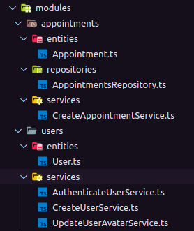

Ah e os arquivos da pasta models foram movidos para pasta entities

- Dentro da pasta shared estão as pastas database, errors, middlewares e routes.

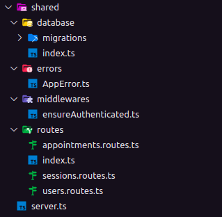

## Camadas de domínio e camada de infra

### Infra: decisões tecnicas.
  src/shared/infra
  ferramentas, frameworks, stack, banco, biblioteca e etc.
  Coloca apenas coisas que um dia podem ser migradas, e não dependentes como a pasta errors.

  tudo o que for relacionado com express, ou com a camada http da aplicação ficará no diretório shared/infra/http
  middlewares, rotas e o arquivo server.ts

  mkdir src/modules/users/infra/typeorm
  mkdir src/modules/appointments/infra/typeorm

  como as entidades(entities) são puro typeorm, obviamente serão movidas para /appointments/infra/typeorm e será feito o mesmo no modulo users

  rename shared/infra/database shared/infra/typeorm

### Domínio: decisões de regras de negócio.
  o que o nosso Cliente/Usuário precisa.

### services isolam regra de negócio

em ts.config descomentar baseUrl e paths e colocar

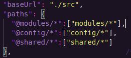

Para diminuir a importação com os atalhos, haverá menos '../../../'

mkdir modules/appointments/infra/http/routes

cd shared/infra/http/routes
mv appoitments.routes.ts /modules/appointments/infra/http/routes/

e o mesmo acontece com a rota e modulo de usuarios, a rota sessions está ligada com usuários

reorganizar as importações aos seus devidos em shared/infra/http/routes/index.ts

cd shared/infra/http
mv middlewares /modules/users/infra/http/

reorganizar as importações nas rotas de appointments e usuarios

reorganizar as importações nas entidades de appointments e usuários

reorganizar a importação de entidade nos repositórios appointments e usuários

reorganizar as importações em services.

reorganizar a importação de rota em shared/infra/http/routes/server.ts

trocar o endereço do arquivo de inicialização la no package.json no fim do comando dev:server e start, de src/server.ts para src/shared/infra/http/server.ts.

o node não intende as importações com a @ como o VSCode é necessario instalar a lib tsconfig-paths -D

e no inicio do comando dev:server colocar uma flag -r tsconfig-paths/register

# Liskov Substitution Principle
Nesse momento isolei um pouco mais a camada de appointments da aplicação, ela ainda tinha uma importação do typeorm. E para facilitar na manutenibilidade do código temos que isolar com uma interface.  Sendo assim criamos uma interface em src/modules/appointments/repositories/IAppointments.

Além disso foi implementado uma nova regra eslint para criação de interfaces.

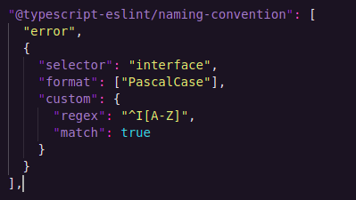

essa regra nos obriga a colocar um I em todas as interfaces do projeto.

<a href="https://github.com/typescript-eslint/typescript-eslint/issues/1915">[interface-name-prefix]</a>

dentro de infra coloquei a pasta repositories dentro de typeorm

e criei a interface no modulo de agendamentos

mkdir src/modules/appointments/repositories
touch src/modules/appointments/repositories/IAppointmentsRepository.ts

 a estrutura de pastas ficou assim:
  
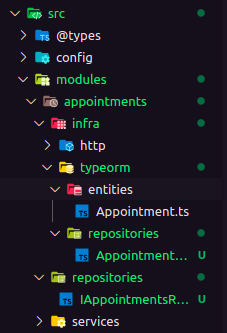

dentro dessa interface:
 
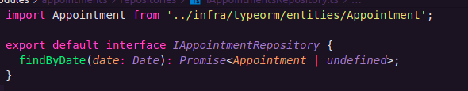

e repository que está dentro de typeorm eu importo essa interface e a implemento, também alterei o retorno que antes era Appointment ou null, agora está Appointment ou undefined.

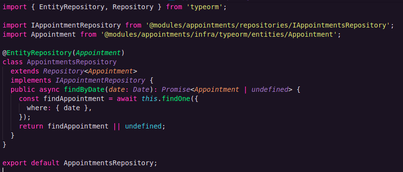

o que foi intendido aqui é que isolamos a nossa entidade para facilitar uma troca de banco se necessario, no futuro.

## Rewriting repository

Começamos a desacoplar as regras de negócios da parte de infra. em services o arquivo presente ainda utiliza metodos do typeorm.

refatoramos bastante o nosso repositório, prefiro mostrar a ilustração do que mudou pra facilitar o entendimento:
 
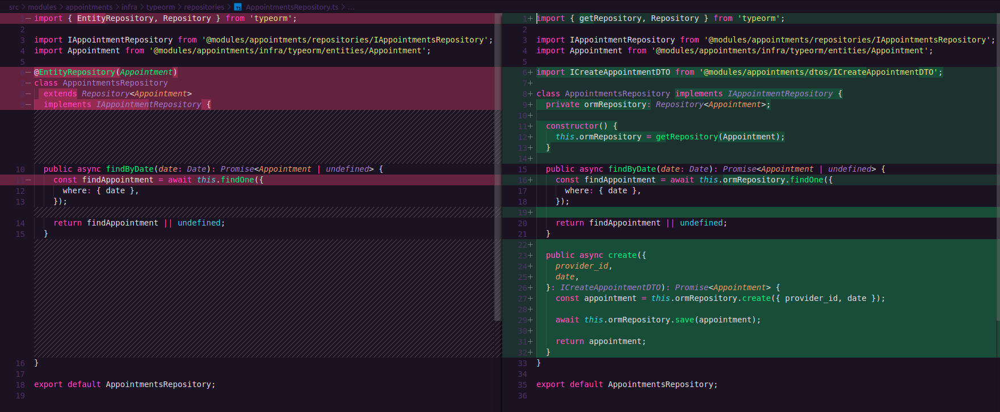

mkdir src/modules/appointments/dtos
touch src/modules/appointments/dtos/ICreateAppointmentDTO.ts
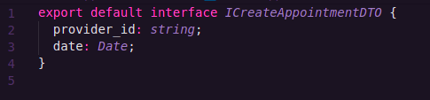

isolei a interface que tipava o parametro do método execute() na classe CreateAppointmentService e removi a interface que estava acima, em services.
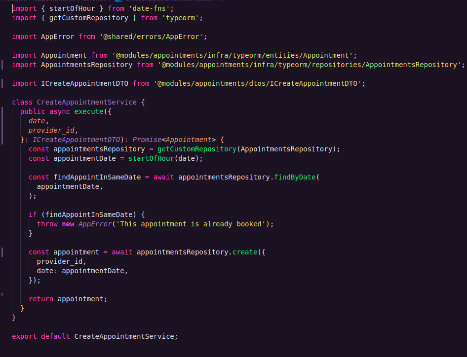

# Dependency inversion principle

Inversão de dependência. A Letra "I" do SOLID

Single Responsability Principle  
Open Closed Principle  
Liskov Substitution Principle  
Interface Segregation Principle  
Dependency Invertion Principle  

Ao invés do service lidar diretamente com o repositório importado no arquivo do service, iremos receber esse mesmo repositório como parâmetro do constructor desse service passando o tipo dele como sendo a interface criada anteriormente para implementar no próprio repositório.

foi necessario desabilitar uma regra eslint para usar o constructor.
"no-useless-constructor":"off",

foram refatorados a rota de appointments e o service de criação de appointment que um ponto que usa muito da camada de infra, porém foi decidido não isolar completamente o service, até o momento.

ilustração das mudanças:
 -
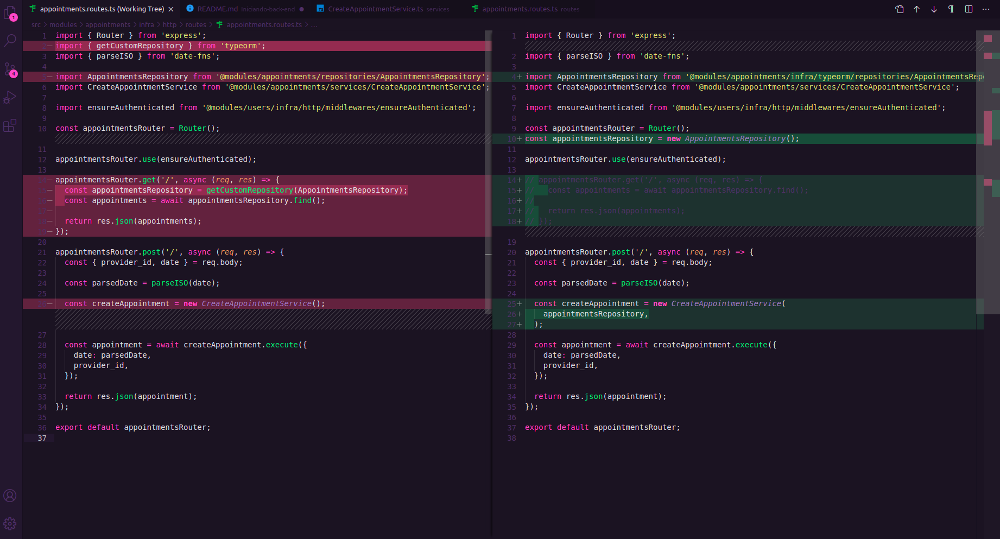
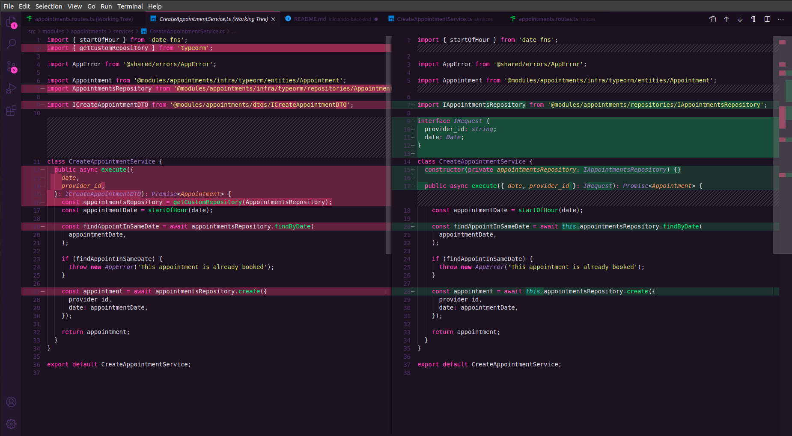

# Refatorando módulo de usuários

mkdir src/users/repositories/
touch src/modules/users/repositories/IUsersRepository.ts

Métodos nos services a serem refatorados no modulo users:
 

- findById
- findByEmail
- create
- save

Removemos tudo que é diretamente relacionado com typeorm dos services como fizemos anteriormente.

na rota de usuário e de sessões:
 
 é necessário importar a classe UsersRepository que fica em @modules/users/infra/typeorm/repositories/UsersRepository

 e criar uma variavel que a instancie essa classe, e passar essa variavel como parâmetro em CreateUserService() e UpdateUserAvatarService.

 A aplicação ainda não vai rodar. Como trocamos toda a estrutura de pastas e arquivos incluindo as rotas, é necessario trocar os diretórios das entities, migrations, e migrationDir nas configurações do typeorm

 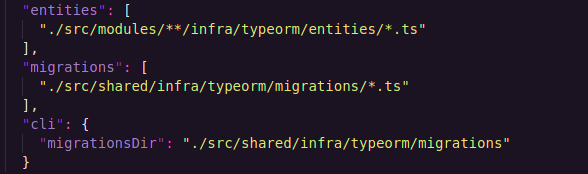

